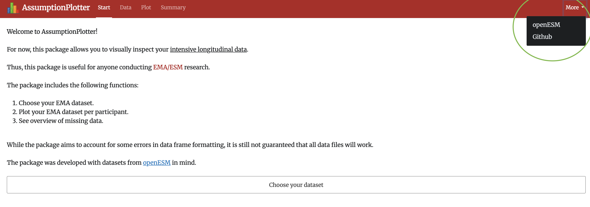
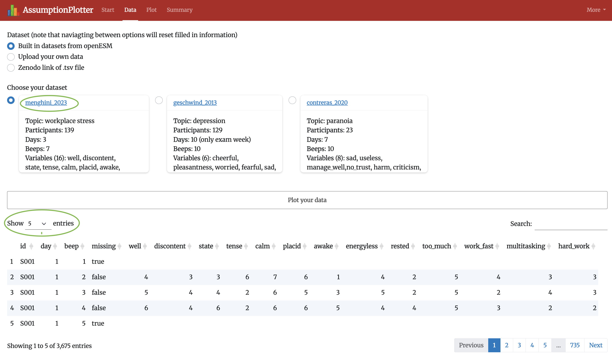
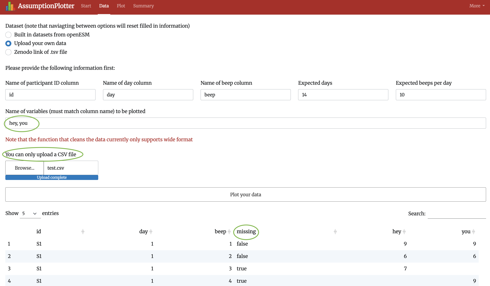
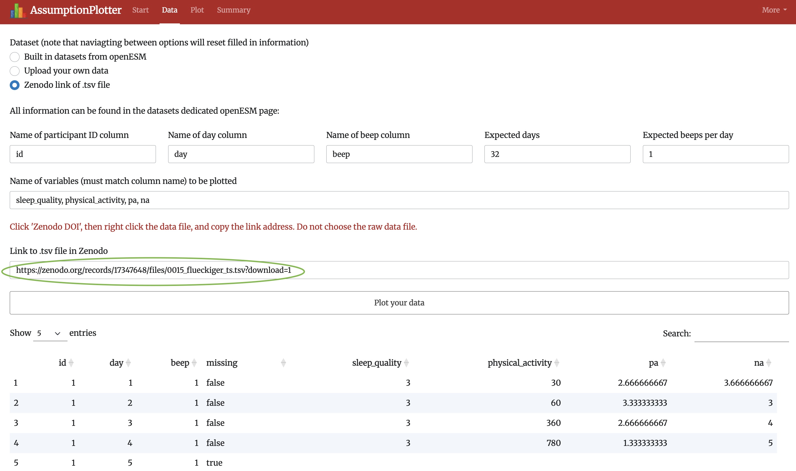
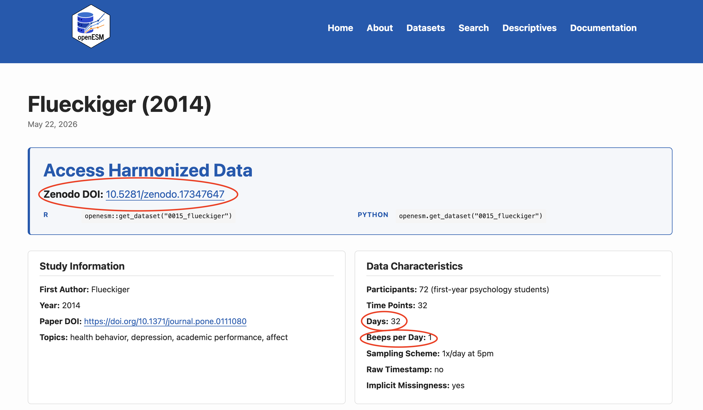
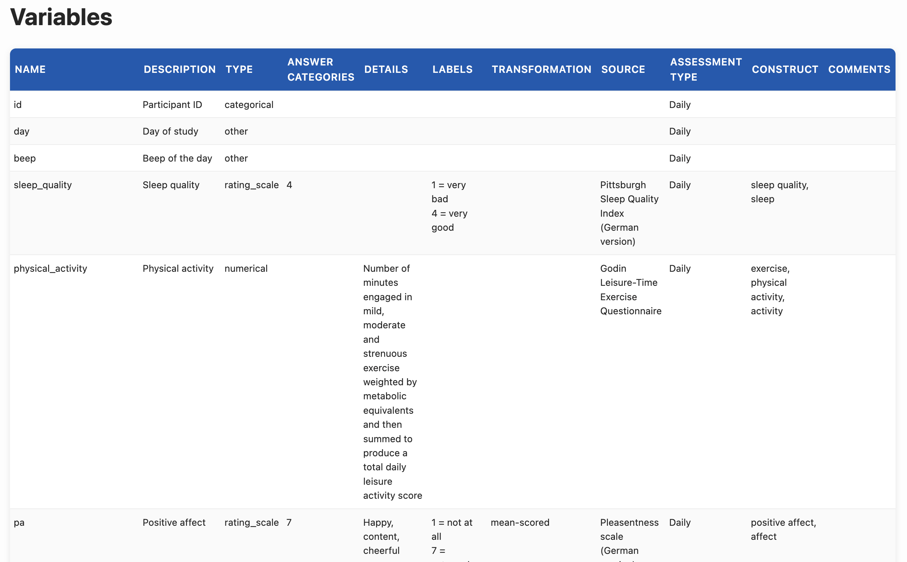
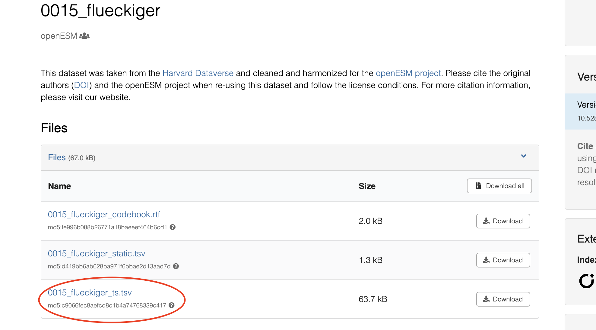
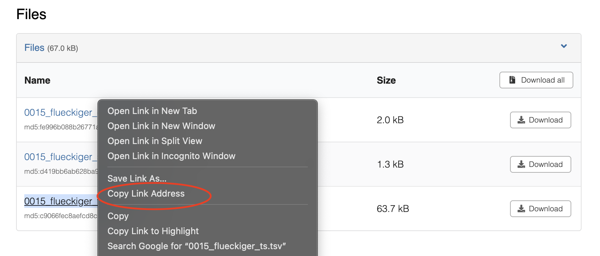
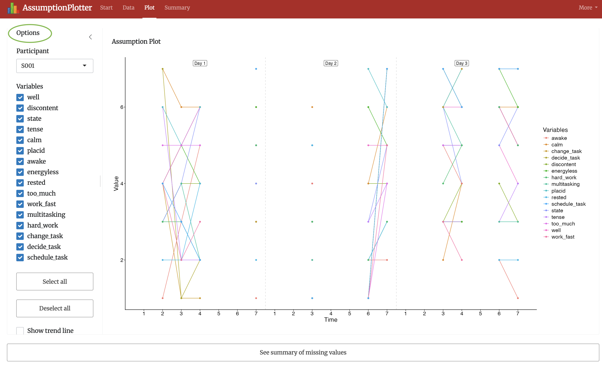
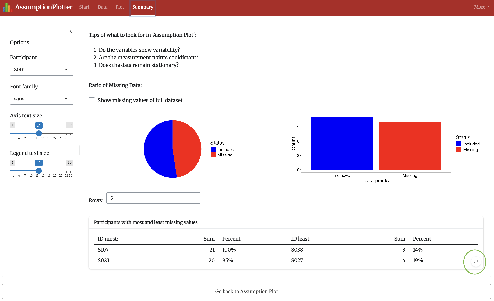

```{r, eval=F}
#| label: setup
library(AssumptionPlotter)
```

This package was created in `R` code, and therefore requires you to have it installed. It was created in **Rstudio**, so the app is likely most straightforward to run from there. You can find the instructions to download RStudio <a href = "https://posit.co/download/rstudio-desktop">here</a>.

For problems with the package, please contact emma.akrong@gmail.com

Required packages:

```{r, eval=FALSE}
library("ggplot2") # For plots
library("testthat") # To run unit tests
library("usethis") # To edit package
library("knitr") # To render/create quarto file
library("quarto") # To render/create quarto
library("shiny") # To create app
library("bslib") # To format user interface of app
library("DT") # To create interactive table in app's data page
library("sass") # To edit font
library("readr") # To read csv/tsv files into tibbles
library("dplyr") # To edit data frames for plots/tables
library("tidyr") # To edit data frames for plots/tables
library("grDevices") # Access color palettes for assumption plot
```


## Welcome to AssumptionPlotter!

At the moment, this package creates an app that allows for visual inspection of EMA/ESM data.

The package was developed with the datasets from <a href = "https://openesmdata.org/datasets/">openESM</a> in mind, and can currently plot built-in datasets, the users own data, and data from openESM accessed through the link to download the dataset from its dedicated Zenodo page. However, the last option is not guaranteed to work.

The purpose is to give EMA/ESM researchers a nice overview of what their data looks like, and possibly guide decisions on what statistical model to use. It plots according to the expected days and beeps of the study, and therefore requires all participants to have the same study lengths. You can currently only plot the variables of one participant at the time. 

While "*PlotESM*" currently might be a more fitting name, ideally some statistical tests will later be implemented.

The main functions created by this package are:

```{r, eval=FALSE}
run_plotter() # Launches the shiny app
clean_df() # Cleans data uploaded/linked to by the user
assumption_plot() # Main plot of the app
pie_bar_chart() # Plots summarizing how many missing values
rank_participants() # Table showing who had the most and least missing values
```

You can get more information about them by e.g., running `?run_plotter()` in your console (accessing the function's help file), once you've installed the package.

We will now take a tour of the package.

## Running AssumptionPlotter

### Install Package

To install the package, run this code in your console:

```{r, eval=FALSE}
remotes::install_github("Programming-The-Next-Step-2026/Assumption-Plotter",
               subdir = "AssumptionPlotter",
               build_manual = TRUE,
               build_vignettes = TRUE)
```

It might ask you to update your packages. You can choose not to, but it is not guaranteed that the app will run as intended.

### Launch App

The first step after installing the package is to open it in your library and run the function `run_plotter()`.

```{r, eval=F}
library(AssumptionPlotter)

run_plotter()
```

This will launch the app and take you to the start page:

{style="width:100%;"}

It is recommended that you use the app in full-screen mode as some features (e.g., the table in the data page) otherwise might be hidden. Also note that if you're running the app in RStudio, blank screens might pop up when you press a hyperlink. This does not happen when you run it in your browser.

Press the "*Choose your dataset*" button or navigate to the data tab in the menu bar. You cannot plot anything until a dataset has been chosen. 

Note that you in the menu bar can find the link to the openESM webpage and the github repository (see the green circle in the plot).

In all following images, pay attention to information outlined in the green or red circles. 


### Choose Data

In the "Data" page you have a few options. You can use the built in datasets, upload your own, or use the link to the tsv file in Zenodo.

#### Built-in data

To familiarise yourself with the app, you can choose one of the built-in datasets.

{style="width:100%;"}

These datasets were chosen at random and are by no means perfect. However, they can for example highlight how messy the data is (e.g., in `geschwind_2013` most participants have no data in the last days, although it's indicated that there should be 10 days).

You can press the hyperlink to access the data's dedicated openESM page. To preview more of the data, just choose another option in "Show" at the top-left of the table.

You can then press the "*Plot your data*" button.


#### Upload data

By choosing "*Upload your own data*", you will be instructed to follow a few steps:

{style="width:100%;"}

`clean_df()` that cleans the data for the plotting functions, requires you to input the name of the id, day, and beep column (the pre-filled names are "id", "day", and "beep"). As well as how many days and beeps per day each participant should have. You also need to manually fill in the names of all the variables you want to plot. 

In the app, it says that only csv files are accepted. This is true, however, you can edit this in the server in the "app.R" file (line 514; e.g.: `accept = c(".csv", ".tsv")`). You can also edit line 610 to use a different read function. The data is currently read using `readr::read_csv()`, which technically also could work for tsv files. 

When you're happy, you can move to the Plot page. 


#### Zenodo link

The final option is to upload the data using the dataset's download file, which can be found in Zenodo. An example link is circled in green:

{style="width:100%;"}

To access the link you will have to take a few actions. Start in the data's dedicated openESM page and follow the following steps:

{style="width:100%;"}

On this page you can find the expected days and beeps (circled on the right). 

If you scroll down a bit, you will also find the names of the variables (columns). Fill these out in the app. Note that some pages have the names of the id, day, and beep columns at the bottom.

Fill in all required information in the app and then press the Zenodo DOI link.

{style="width:100%;"}

Pressing the Zenodo DOI link should show you the downloadable files. Make sure to not pick the raw or static files, but the one circled in red.

{style="width:100%;"}

Then access the link by right clicking, copy the link address, and paste the link to the app. 

{style="width:100%;"}

Note that this doesn't work for all data. For example, in the development, I could not get "0011_kuppens" to work.

If the data previews successfully. you can move on to plotting.


### Plot Data

When you move to the plot tab, you should see all the variables plotted per day and beep in the Assumption Plot. 

{style="width:100%;"}

A connected line indicates that the participant responded to consecutive beeps. If there is only a dot, it means that the beep was not preceded nor followed by a response. There should be data at every beep. If a beep is empty, this indicates missing data.

In the "*Options*" sidebar you will see different plotting options. Scroll down to see all options. Note that you can control its width. The plot is reactive so should change immediately when change options (with some possible rendering delay). In `assumption_plot()` you can specify the following things that also can be controlled in the plot: 

1. What variables to show.
1. Whether to include a trend line (either linear or loess).
1. Whether to impute missing data (either the mean or mode of the variable).
1. Whether to show the day labels.
1. Whether to include lines separating the days.
1. Whether to edit the plot's color palette (supports any palette from `grDevices::hcl.pals()`).
1. What ggplot theme the plot should have (options can be edited in "app.R").
1. What font the plot should have.
1. Font size of the axes.
1. Font size of the legend.

In "app.R", all of these have preset values. These are not necessarily the same as those seen in "examples" in the help file.

You can play around with the different options. Note that the plot will not render if no variables are chosen. It might also take a while for the plot to render, depending on how quickly the app can load the data. 

If you're curious about a summary of the missing values, you can press the "*See summary of missing values*" button at the bottom of the screen and move on to the "*Summary*" page.


### Summary Page

The "*Summary*" page starts with some tips for what to look for in the Assumption Plot in the "*Plot*" page. This could be next to the plot, but I wanted to make the plot as big as possible.

{style="width:100%;"}

Next, you will see a pie and bar chart showing the ratio of included to missing data for the selected participant. When navigating from the "*Plot*" page to the "*Summary*" page, it will remember what participant and font should be plotted. However, if you change the participant in the "*Summary*" page and then move back to the "*Plot*", you'll have to manually change it again for the Assumption Plot. 

You can also choose to plot the missing data in the entire dataset in the pie and bar chart. This way you can compare the participant's adherence to all other participants.

Under the plots you find a table summarising which participants had the most and least missing values. This could e.g., be useful for knowing who to pick for the Assumption Plot when you're interested in trends in the data. You can edit the amount of rows the table should show (note that this cannot exceed the sample size) and then, as seen in the bottom-right of the page when you hover over the table, you can expand the table.

At the bottom of the "*Summary*" page there is button to allow for easy navigation between the "*Summary*" and "*Plot*" pages. 


<h1 style = "color:#b22222;">Hope it works nicely for you!</h1>
<h3 style = "color:#b22222;">
Kind regards,
<br>Emma
</h3>

