```{r}
#| label: setup
library(AssumptionPlotter)
```

This package aims to give a an overview of whether the user's data matches the statistical model they intend to use.

While it tests whether the data matches meets the statistical assumptions of the models, it also aims to give an intuition of whether the statistical model will capture what the user wants see in the data. 
For example, in the case of a study with intensive longitudinal data, the user might expect to see change. This package aims to show how e.g., a VAR model would not be able to reflect this expectation.


# Running AssumptionPlotter

The first step after installing the package is to run the function `run.plotter()`.

```{r, eval=F}
run.plotter()
```


# TO ADD

::: {layout-ncol=3}

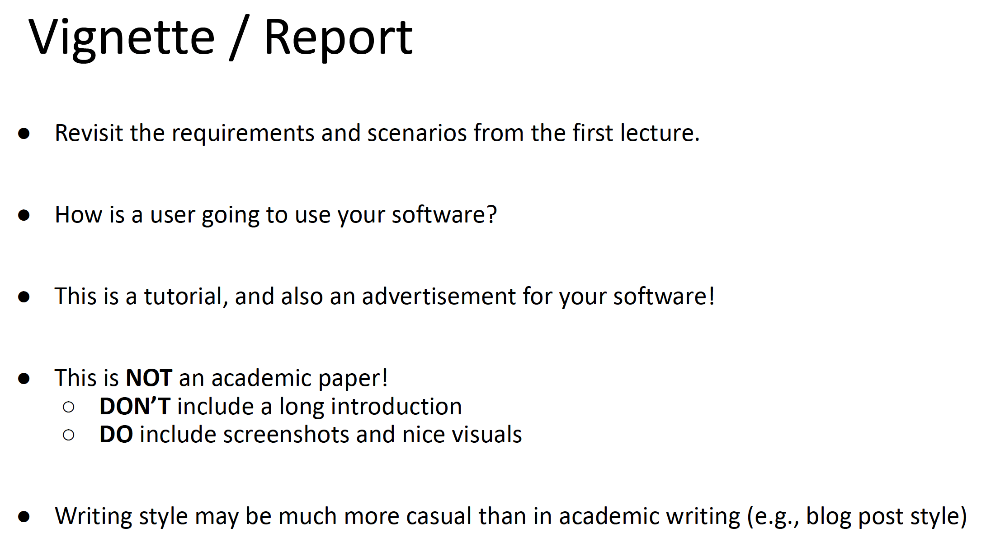

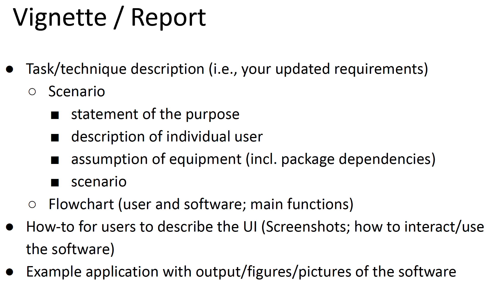


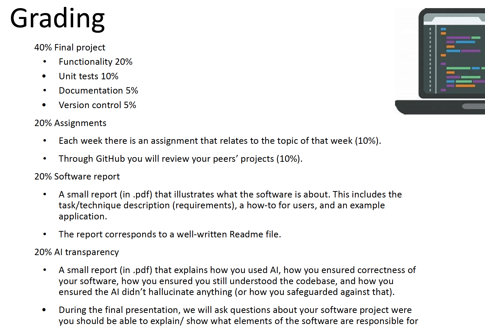

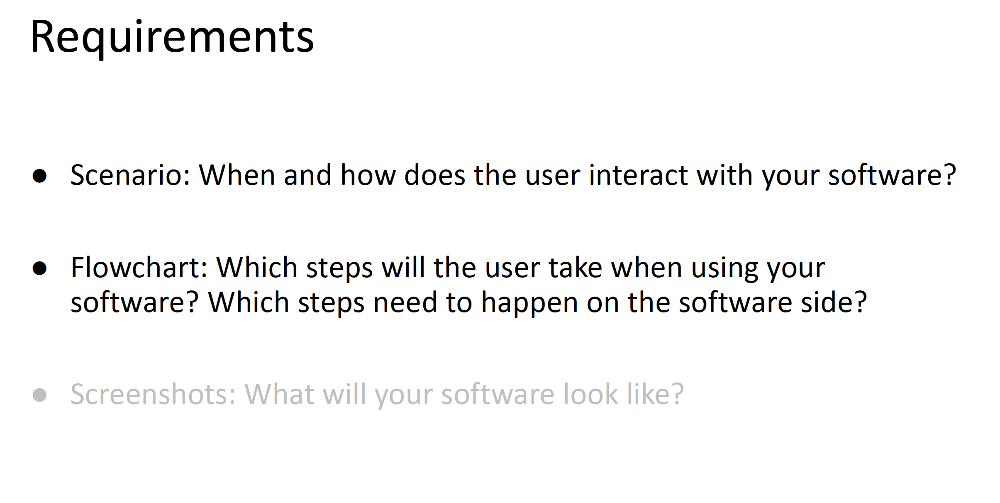

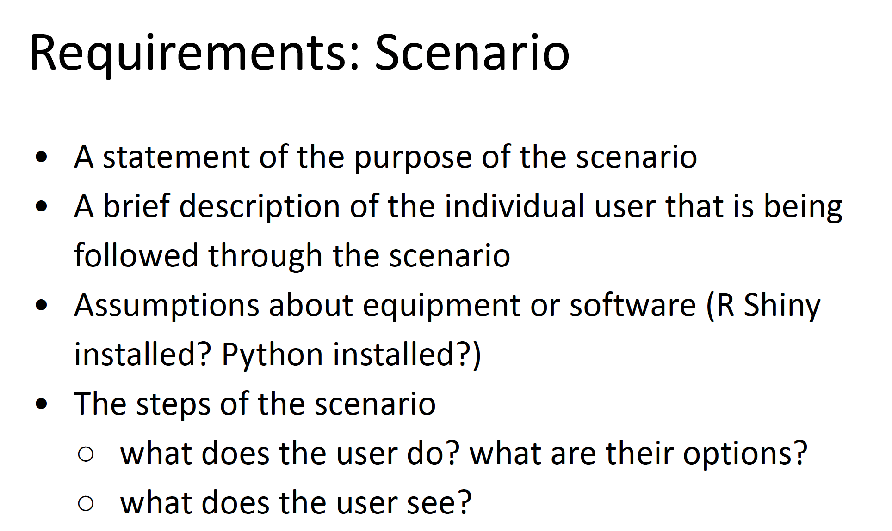

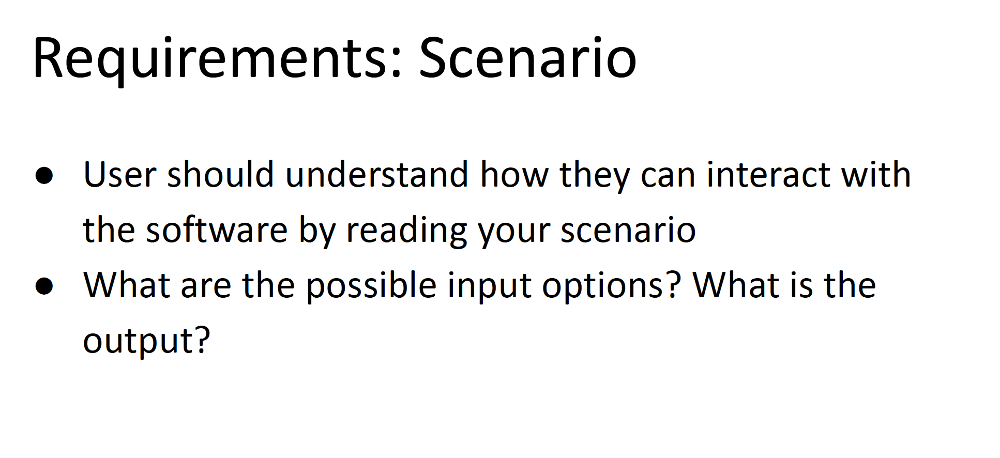


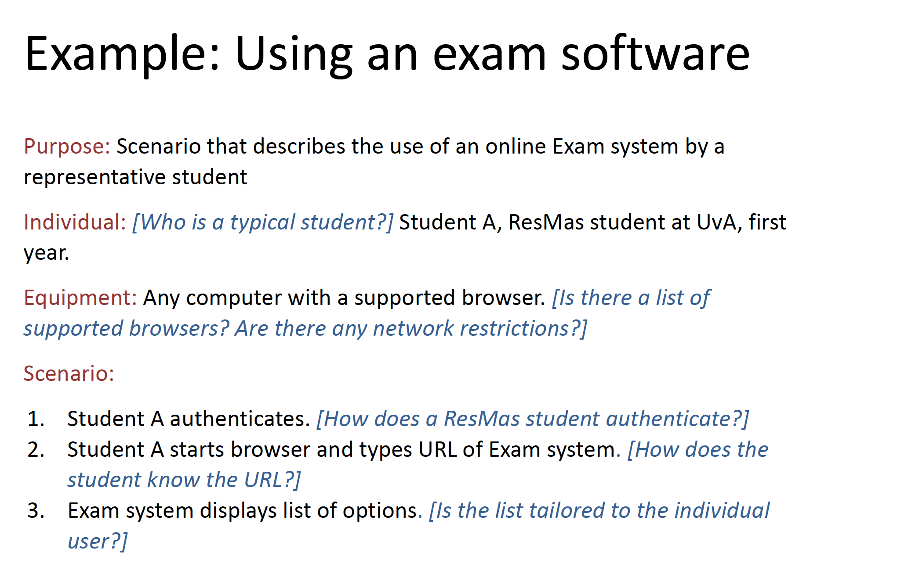

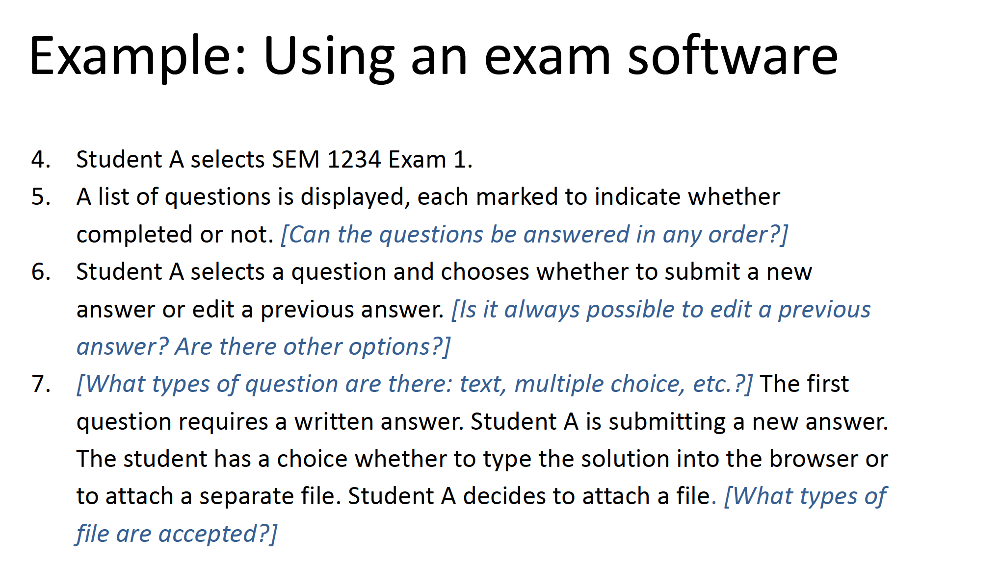

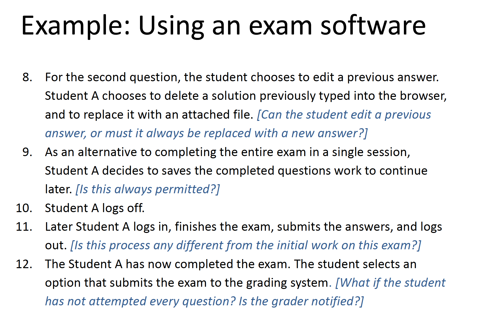

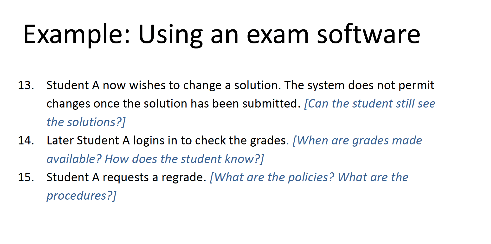

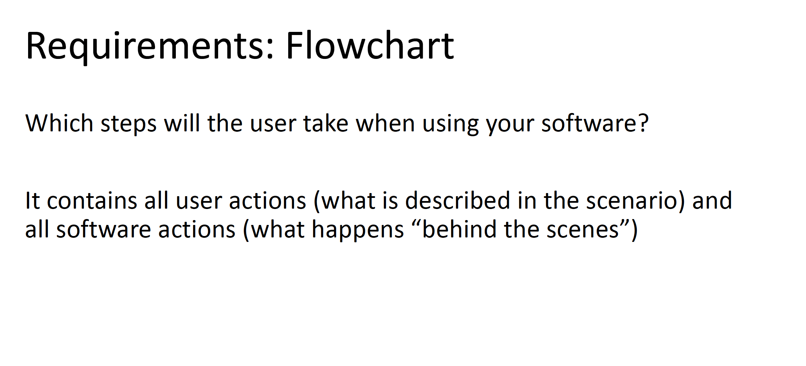

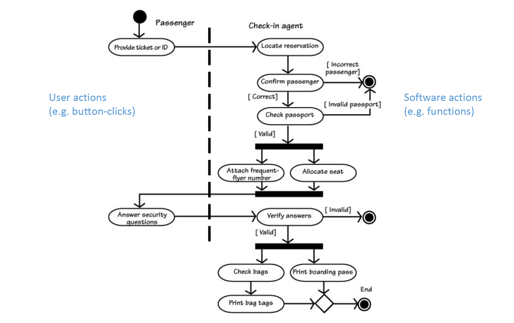

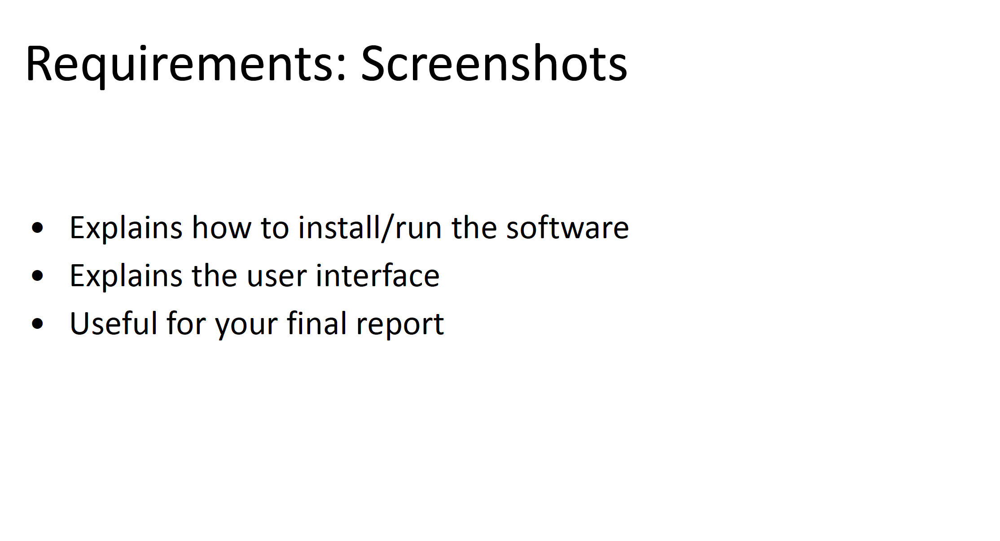

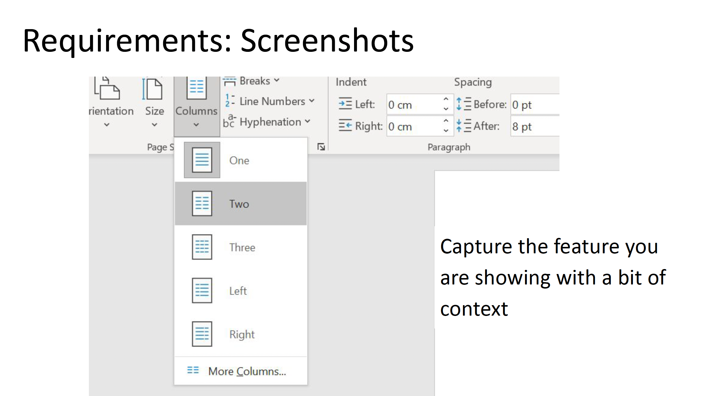

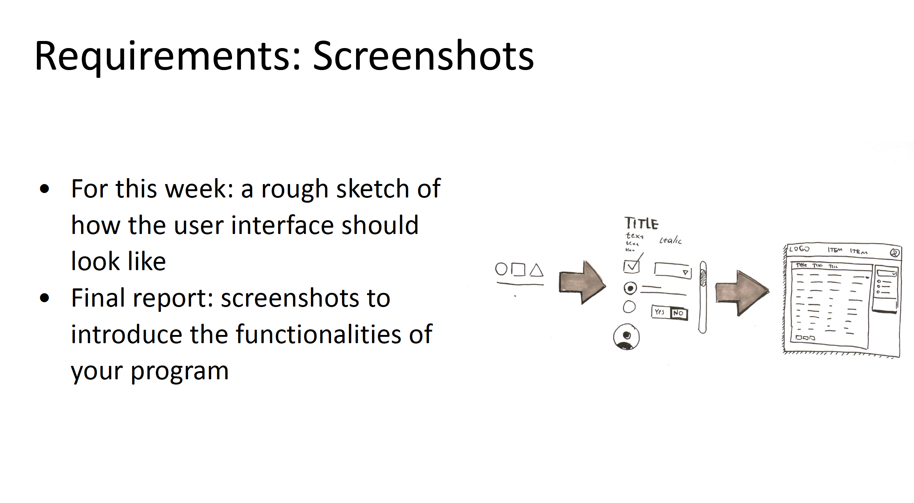


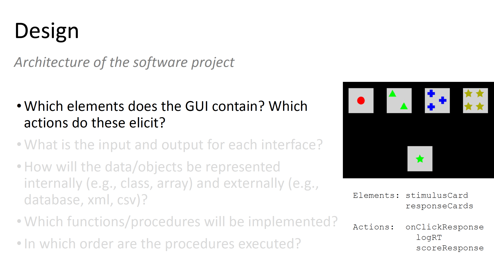

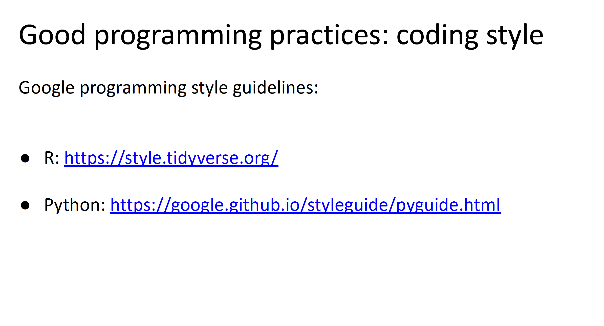


:::
